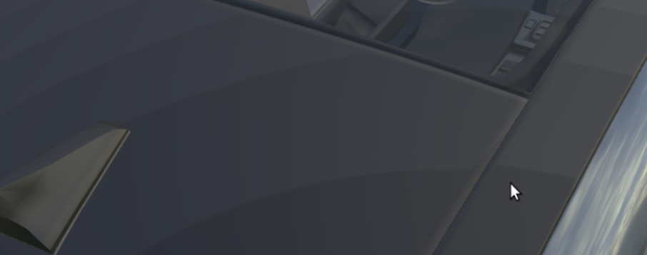
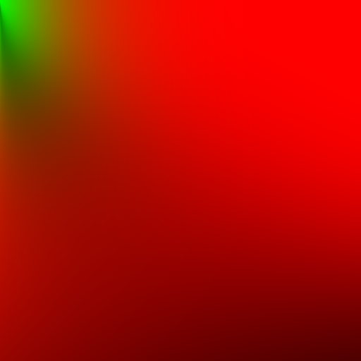

# BRDF Generator
This is a simple program that generates Smith GGX BRDF lookup tables for the split sum approximation of the UE4-based PBR pipeline. 

This is rewrite in Julia of https://github.com/HectorMF/BRDFGenerator

# Banding problem
<p align="center"></p>
Problmetaic material has roughness f = 0.45 (not perceptual) and metallic f = 0.78

If you have concentric bands on surface it is highly probably due to clamping of values in your BRDF lookup table. For this you need higher precision like 16 bits per channel. This program generates 512x512 brdf lookup table as png file with 16 bit depth.


Image included is generated with `samples=1000` value.
<p align="center"></p>

# Bootstrapping julia installation
Start julia interpreter and issue the following commands:
```
using Pkg
Pkg.add("Images")
Pkg.add("Colors")
Pkg.add("FileIO")
Pkg.add("LinearAlgebra")
Pkg.add("FileIO")
Pkg.add("Printf")
```

# Usage
Edit samples variable in main function and run the script:
```
julia ./brdfgen.jl
```
# Algorithm
```
For each pixel (x, y):
   Compute roughness (0 to 1.0) based on pixel x coordinate.
   Compute NoV (0 to 1.0) based on pixel y coordinate.
   Set view as float3(sqrt(1.0 - NoV * NoV), 0, NoV).
   Set normal as float3(0, 0, 1). 
   For each sample:
        Compute a Hammersely coordinate.
        Integrate number of importance samples for (roughness and NoV).
        Compute reflection vector L
        Compute NoL (normal dot light)
        Compute NoH (normal dot half)
        Compute VoH (view dot half)
        
        If NoL > 0
          Compute the geometry term for the BRDF given roughness squared, NoV, NoL
          Compute the visibility term given G, VoH, NoH, NoV, NoL
          Compute the fresnel term given VoH.
          Sum the result given fresnel, geoemtry, visibility.
   Average result over number of samples.
```

# References
- http://gamedevs.org/uploads/real-shading-in-unreal-engine-4.pdf
- https://learnopengl.com/#!PBR/IBL/Specular-IBL
